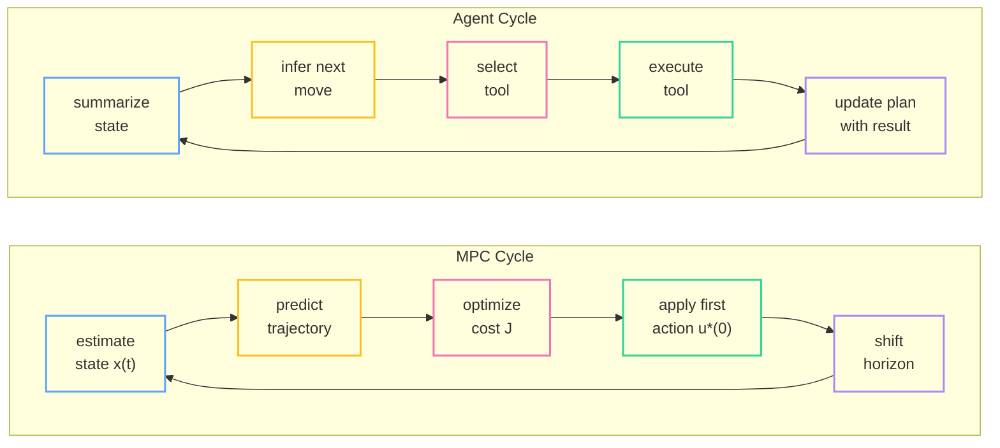

# Your AI Agent Is a Control System (It Just Doesn't Know It Yet)

> Source: http://bolu.dev/machine-learning/2026/02/26/ai-agents-are-control-systems.html
> Collected: 2026-10-02
> Published: 2026-02-26

# Your AI Agent Is a Control System (It Just Doesn't Know It Yet)

February 26, 2026 bolu-atx / ⏱ 18 min

[ai](/tag/ai) [llm](/tag/llm) [control-theory](/tag/control-theory) [machine-learning](/tag/machine-learning)

Suppose your coding agent sees three failing tests, opens the wrong file, makes an edit that fixes one failure and creates two new ones, runs the tests again, notices the blast radius, backs up, and tries a narrower patch.

That is not “just inference.” That’s a feedback loop.

More specifically: it’s an iterative policy acting on a partially observed environment, using fresh observations to update its next move. If you come from ML, that’s already enough to make the control-theory comparison useful. You don’t need to believe an LLM agent is literally an industrial controller. You just need to notice that once the model is embedded in a tool-use loop, the thing you’re evaluating is no longer a one-shot predictor. It’s a dynamical system.

That shift matters because it changes what “good” means.

- A good base model is not automatically a good closed-loop agent.
- A bad planner can destabilize a strong model.
- A weak verifier can make a bad agent look competent for a surprisingly long time.
- Most real failures are not “wrong answer once.” They’re oscillation, drift, and local hacks that look good for two steps and bad for twenty.

That is the part I think control gives us: not fancy vocabulary, but a cleaner way to talk about what these systems are doing, where they fail, and what to optimize.

## The Useful Claim, Stripped Down

Here’s the claim in plain English:
> An agent is a controller wrapped around a world model and a set of actuators.

The “world model” is the LLM’s learned prior over how code, shells, APIs, and people behave. The “actuators” are tool calls: edit a file, run a command, open a browser tab, send a message, call a retriever. The “plant” is the external environment those actions hit: the repo, the compiler, the test suite, the network, the human user.

Once you wire those pieces together, the loop looks like this:

1. Observe the current state as imperfectly as you can.
2. Predict what a few candidate actions will do.
3. Pick one action.
4. Execute it in the real world.
5. Measure the result.
6. Repeat until you hit the goal, a budget, or a failure condition.

That is the control lens. Not “LLMs secretly solve Riccati equations.” Just: this is a closed-loop sequential decision system, so the right questions are now about feedback, stability, observability, horizon length, and cost shaping.

## The Mapping That Actually Matters

You can map the usual control terms onto agent systems pretty directly:

| Control idea | Agent analogue       | Why it matters                                             |
| ------------ | -------------------- | ---------------------------------------------------------- |
| Plant        | External environment | Repo, shell, browser, APIs, user                           |
| State        | Working state        | Files read, diffs applied, errors observed, plan status    |
| Observation  | Context              | What the model can currently see about that state          |
| Controller   | Agent policy         | The logic that chooses the next action                     |
| Action       | Tool call            | Edit, search, test, browse, ask, terminate                 |
| Dynamics     | Environment response | What actually happens after the action                     |
| Cost         | Reward / penalties   | Time, tokens, failures, broken tests, user dissatisfaction |
| Horizon      | Planning depth       | How far ahead the agent reasons before acting              |

The important caveat is that this mapping is not exact. Classical control usually assumes a cleaner state representation, known dynamics, and explicit costs. Agents have none of that. Their state is messy, partially latent, and partly summarized in natural language. Their dynamics are a mix of code semantics, tool behavior, and model beliefs. Their cost function is often implicit and badly specified.

But “messy control problem” is still a control problem.

## Why Receding Horizon Is the Right Mental Model

The most useful control analogy here is model predictive control, or MPC.

In MPC, you simulate a few steps ahead, pick the best action sequence, execute only the first action, then re-plan from the new measured state. That last part is the whole game. You don’t commit to your full rollout because the world is going to surprise you.

That is exactly how good agents behave.

They do not decide on a 20-step plan and then march through it blindly. They sketch a trajectory, take one action, look at the new evidence, and update. If the test output or file contents disagree with the model’s prediction, the plan should change immediately.

The standard finite-horizon objective is:

\\[\min_{u_0, \ldots, u_{N-1}} \sum_{k=0}^{N-1} \ell(x_k, u_k) + V_f(x_N)\\]

subject to

\\[x_{k+1} = f(x_k, u_k)\\]

In agent terms, that says: choose a sequence of candidate actions that trades off short-term cost against long-term task completion, given your current guess about how the environment will respond.

The practical translation is less glamorous:

- don’t optimize only for the next token
- don’t optimize only for the final answer
- optimize for trajectories

That means the unit of evaluation is not “was this thought good?” It’s “did this loop move the system toward the goal?”

## A Coding Agent Really Does Run a Receding-Horizon Loop

If you look at real coding agents, the loop has the same shape:

1. compress or normalize state
2. infer the next move
3. detect whether that move needs a tool
4. execute the tool
5. feed the result back into the next iteration

That is not a metaphor in the hand-wavy sense. The implementation details differ, but architecturally it’s the same receding-horizon pattern: estimate, act, observe, re-plan.

What does that buy you?

For me, three things:

1. It tells you why single-step evals are not enough. A model can look great at choosing the next action and still be terrible over 30 steps because its errors compound.
2. It tells you why verifiers matter so much. Fast, high-signal feedback is what keeps the loop from drifting.
3. It tells you why planning depth is a resource. Too short and the agent thrashes. Too long and it hallucinates a brittle plan that reality invalidates immediately.

## Context Management Is State Estimation

The second useful control analogy is state estimation.

An agent never sees the full environment directly. It sees shell output, diffs, logs, snippets, summaries, and maybe the user’s last message. That is an observation stream, not ground truth. The agent has to compress those observations into an internal state that is good enough for the next action.

That is why context management matters so much. Summaries are not just token-budget hacks. They are your state estimator.

In classical control, moving horizon estimation keeps a recent window of observations plus a compact summary of older history. Agent systems do the same thing when they summarize prior steps, fold resolved subtasks into a short note, or carry forward only the facts that still constrain the future.

When that summary is bad, the controller acts on the wrong state. You see this immediately in practice:

- the agent forgets which file it already modified
- it reopens a bug it had already fixed
- it keeps debugging an error that no longer exists
- it starts planning around stale assumptions from 20 turns ago

That is not just “context window pressure.” It is a state-estimation failure.

This is also where a lot of current agent work feels more like systems engineering than pure modeling. Better summarization, better scratchpads, better memory schemas, better subtask boundaries, better retrieval, better tool output formatting: all of these improve the quality of the state estimate the policy is acting on.

## Failure Modes Look Like Control Problems Too

Once you view the loop as a dynamical system, the common failure modes stop looking random.

### Convergent

The agent makes progress monotonically enough that small mistakes get corrected and the loop still settles. Test failures trend down. Diffs get narrower. The agent’s search becomes more local as it approaches the target.

### Oscillatory

The agent flips between incompatible local fixes.

You see this when it alternates between two hypotheses:

- patch implementation to satisfy test A
- patch test fixture to satisfy implementation
- revert patch because test B now fails
- reintroduce the original behavior because test A broke again

This is the agent equivalent of an underdamped system. There is feedback, but the gain is wrong or the state estimate is incomplete, so it overshoots.

### Divergent

The loop gets worse with each iteration. New edits create more failures than they remove. The agent starts reasoning from artifacts it introduced itself. It chases phantom APIs, stale stack traces, or nonexistent invariants.

That is the failure mode people often call “hallucination,” but “divergence” is more precise. The issue is not just that one belief is false. The issue is that the closed-loop system is moving away from the target.

## You Probably Can’t Prove Stability, But You Can Instrument It

Classical control has Lyapunov functions: scalar quantities that go down when the system is moving toward a stable equilibrium.

For agents, we usually do not have anything that clean. There is no general scalar “distance to solved” for arbitrary software tasks.

But the instinct is still right. You want proxies for progress, and you want to know when they stop improving.

For coding agents, useful progress signals often look like:

- number of failing tests
- compile errors
- linter violations
- diff size
- number of files touched
- repeated edits to the same region
- repeated execution of the same command without new information

None of these is a perfect Lyapunov function. All of them can be gamed. But if you log them over time, you can tell the difference between progress, dithering, and collapse much earlier than if you only inspect the final answer.

This is the practical “what does it mean?” part:

- Treat agent runs as trajectories, not outputs.
- Instrument intermediate state, not just final success.
- Add guardrails when progress proxies flatten or reverse.
- Terminate or escalate when the loop is clearly oscillating.

That is a control mindset.

## Beyond a Single Agent Loop

So far I’ve been talking about one agent running one receding-horizon loop. But a lot of production systems are already more complicated than that.

You have an inner loop that does the local work: inspect state, call tools, update the plan, verify the result.

Then you have an outer loop that decides when the inner loop should run at all:

- a cron trigger
- a queue consumer
- a supervisor watching for failures
- a human or service that keeps reissuing goals over time

That is no longer just one controller. It starts to look like a multi-rate control system: a fast inner loop for tactical correction, wrapped in a slower supervisory loop that sets timing, budgets, and objectives.

That framing explains a few production failure modes that are otherwise easy to misdiagnose.

### Deadband and Hysteresis

One of the easiest ways to make an agent waste money is to let it re-plan on every tiny fluctuation.

In control, a **deadband** means “ignore small deviations.” A thermostat doesn’t switch on because the temperature moved by a tenth of a degree. It waits until the deviation is large enough to matter.

Agents need the same thing. If the latest observation barely changes the plan, the system should often keep going rather than trigger a full re-plan. Otherwise you get chattering: endless tiny updates that burn tokens without changing the trajectory.

**Hysteresis** is the related idea that switching modes should require a bigger signal than staying in the current mode. That is useful for agents that keep flapping between strategies:

- research more
- no, start writing
- no, gather more context
- no, go back to writing

You can fix some of this with better prompts, but a lot of it is really control logic. Don’t switch modes on the first wobble. Require stronger evidence to reverse course than to continue.

### Anti-Windup for Retry Loops

Another clean control analogy is **integrator windup**.

In a PID controller, windup happens when the controller keeps accumulating error even though the actuator is already saturated and can’t respond usefully. When the system finally does move again, the controller overshoots badly because it has stored up too much corrective pressure.

Agents do something similar in retry cascades.

The tool is down. The patch failed. The API response is malformed. The test runner is flaky. Instead of recognizing that the actuator is effectively saturated, the agent keeps “trying harder”: more retries, more reflections, more speculative edits, more elaborate workarounds.

That is windup.

The fix is not mystical:

- clamp retries
- cap self-reflection depth
- lower the allowed magnitude of edits after repeated failures
- force a fallback, cooldown, or human handoff when the loop stops getting traction

### When the Outer Loop Makes the Whole System Worse

The multi-rate framing also explains why some agent deployments feel strangely unstable even when the inner loop is decent.

If the outer loop fires again before the inner loop has actually converged, the system starts stacking partially finished control episodes on top of each other. You see overlapping work, stale goals, duplicated effort, and summaries that reflect a world that no longer exists.

In plain English: the supervisor is sampling the system faster than the worker can settle.

That is a very normal control failure. It just happens to show up here as planning drift, queue pileups, and agents stepping on their own diffs.

## What This Changes for Agent Builders

If the control analogy is useful, it should change design decisions. I think it changes at least four.

### 1. Optimize the feedback loop, not just the model

If your verifier is slow, sparse, or ambiguous, your agent is flying mostly open-loop.

A lot of “agent capability” is really feedback quality:

- fast tests beat slow tests
- structured tool output beats raw terminal spam
- narrow diffs beat repo-wide rewrites
- explicit constraints beat vague instructions

A stronger base model helps. But a mediocre model with tight feedback can outperform a stronger model with weak feedback.

### 2. Make state legible

The policy can only act on the state representation you give it.

So make that state cheap to inspect and easy to summarize:

- expose plan state explicitly
- record what has already been tried
- track edited files and unresolved failures
- format tool results so important deltas are obvious

If the agent keeps forgetting what happened, don’t only blame the context window. Blame the state representation.

### 3. Control the action space

Controllers get easier to stabilize when the actuators are sensible.

The same is true here. Agents behave better when the available actions are high-signal and constrained:

- use purpose-built tools instead of raw shell when possible
- prefer patch tools over unconstrained file rewrites
- separate “inspect” actions from “mutate” actions
- require verification after high-impact edits

Part of agent engineering is actuator design.

### 4. Measure horizon quality

Long-horizon capability is not “can the model describe a long plan?” It is “can the loop stay coherent while repeatedly updating that plan under feedback?”

Those are very different abilities.

This is why agent benchmarks that grade only final answers miss something essential. Two systems may both finish the task, but one may do it with tight convergence and the other with catastrophic instability that happened to get lucky before the budget ran out.

## The Real Payoff

So what does it mean to say “AI agents are control systems”?

For me, it means four concrete things:

1. Stop thinking of an agent as a single prediction.
2. Start thinking of it as a closed-loop process with memory, actions, observations, and failure modes.
3. Evaluate the trajectory, not just the endpoint.
4. Design the loop so that reality corrects the model quickly and cheaply.

That’s it.

The control framing is useful not because it makes agents sound more rigorous than they are. It’s useful because it forces a more honest question:

When this thing acts repeatedly on the world, under imperfect information, with limited compute and noisy feedback, does it settle toward the goal or not?

That is the question control theory has been asking for decades. We should probably ask it more often in agent engineering too.

---

## References

1. “Model predictive control,” Wikipedia. [Link](https://en.wikipedia.org/wiki/Model_predictive_control)
2. J. B. Rawlings, D. Q. Mayne, and M. M. Diehl, *Model Predictive Control: Theory, Computation, and Design*, 2nd ed. Nob Hill Publishing, 2017. [PDF](https://sites.engineering.ucsb.edu/~jbraw/mpc/MPC-book-2nd-edition-1st-printing.pdf)
3. “Effective context engineering for AI agents,” Anthropic. [Link](https://www.anthropic.com/engineering/effective-context-engineering-for-ai-agents)
4. Y. Feng et al., “Scaling Long-Horizon LLM Agent via Context-Folding,” arXiv:2510.11967, 2025. [Link](https://arxiv.org/abs/2510.11967)
5. H. Kim et al., “Test-Time Alignment for Large Language Models via Textual Model Predictive Control,” arXiv:2502.20795, 2025. [Link](https://arxiv.org/abs/2502.20795)
6. F. Wang et al., “When control meets large language models: From words to dynamics,” arXiv:2602.03433, 2026. [Link](https://arxiv.org/html/2602.03433v1)
