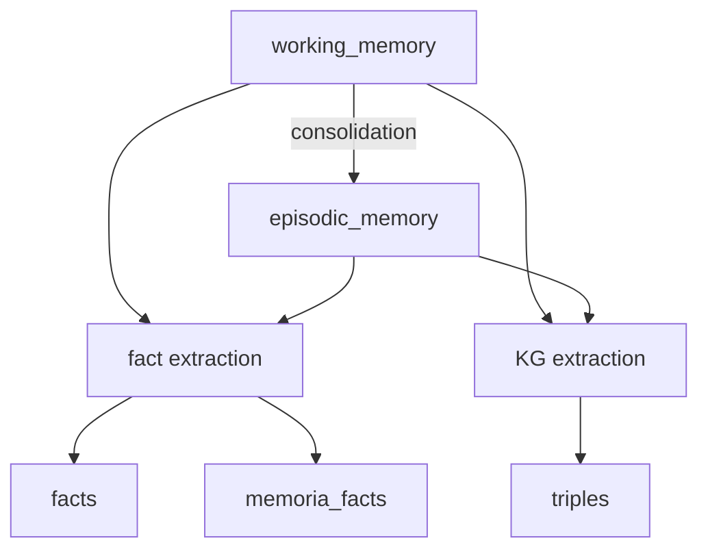

# Mnemopi 数据模型与 Recall/Reflect

> Sources: OMP 源码 d49918fab2; 本会话 memory_edit 实测, 2026-09-26
> Raw: [2026-09-21-mnemopi-data-model](../../raw/omp-mnemopi/2026-09-21-mnemopi-data-model.md); [judgeBatch await 用法](../../raw/omp-mnemopi/2026-09-26-judgebatch-await-usage.md)
> Updated: 2026-09-26

Mnemopi 的记忆分为主内容表、事实表、关系表和辅助索引表。普通 `recall` 只直接消费主内容表与事实表，辅以 FTS 和 embedding 索引；`triples`、graph、memoria 系列表有独立用途。

## 记忆层级



`working_memory` 保存较新的持久记忆条目。`episodic_memory` 保存 consolidation 生成的事件摘要，`summary_of` 记录来源 working IDs。`facts` 和 `memoria_facts` 由同一次提取并行写入。`triples` 由 consolidation 独立提取，带时间有效期。

## 各表职责

### working_memory

保存较新的持久记忆条目。主键为 `id TEXT PRIMARY KEY`，含 `content`、`source`、`timestamp`、`session_id`、`importance`、`consolidated_at`、`scope`、`trust_tier` 等。`consolidated_at` 为 NULL 表示尚未被 consolidation 处理。

### episodic_memory

保存 consolidation 生成的事件摘要。主键为 `rowid INTEGER PRIMARY KEY AUTOINCREMENT`，另含 `id TEXT UNIQUE NOT NULL`。`summary_of` 记录来源 working memory IDs。

### facts

保存便于搜索的结构化事实，采用 `subject — predicate → object` 表示，附带 `fact_id`、`session_id`、`source_msg_id`、`confidence`、`timestamp`。

### memoria_facts

属于事实提取和版本追踪的内部数据表，不构成第三个记忆层级。它保存 `fact_type`、`key`、`value`、`context_snippet`、`message_idx`、`version_id`、`previous_value` 等。同一次提取会同时写入 `facts` 和 `memoria_facts`，前者供 recall 搜索，后者保留提取细节。

`facts` 表只读：`memory_edit` 工具对 `[facts]` 类型的记忆拒绝 `update` / `forget` / `invalidate` 三种操作，返回 `not_editable`（2026-09-26 实测）。跨会话更正一条措辞模糊的 fact 不能修改存量，只能新增一条澄清条目，靠新条内文里的作废声明压过旧条。`working_memory` 类型可编辑，不受此限制。

### triples

保存带时间有效期的知识关系，字段包括 `valid_from`、`valid_until`、`source`、`confidence`。更新同一 subject + predicate 时会关闭旧 triple 的时间区间。Memory Stats 显示的 Triples 来自 `COUNT(*) FROM triples`，可能包含已设置 `valid_until` 的历史关系。

### gists 与 graph_edges

`gists` 是 episodic graph 中的节点摘要，包含 `memory_id`、`gist`、`participants`、`location`、`emotion`、`time_range`。`graph_edges` 保存 `source → target` 的关系边，含 `edge_type` 和 `weight`。

## recall 直接读取哪些表

OMP 调用 `recallEnhanced(..., { includeFacts: true })`：

| 内容 | 主表 | 全文辅助 | 向量辅助 |
|---|---|---|---|
| working | `working_memory` | `fts_working` | `memory_embeddings` |
| episodic | `episodic_memory` | `fts_episodes` | `memory_embeddings` |
| facts | `facts` | `fts_facts` | 无 |

启用 embedding 时，`recall` 直接读取 `memory_embeddings` 的 `memory_id` 和 `embedding_json`，对 working 和 episodic 候选做向量相似度。facts 当前只走 FTS 和主表查询，没有向量检索。

## reflect 直接读取哪些表

Mnemopi `reflect` 复用同一条 recall 路径：

```text
reflect query → state.recallResultsScoped() → recallEnhanced(includeFacts: true) → formatContextScoped()
```

`context` 参数追加为 `Additional context:` 部分。当前实现没有额外 LLM 综合步骤；输出开头的 `Based on recalled memories:` 只是固定文字。

## 普通 recall 不直接查询的表

| 表 | 用途 | 访问方式 |
|---|---|---|
| `memoria_facts` | 事实提取详情与版本追踪 | consolidation 内部 |
| `triples` | 带有效期的知识关系 | `mnemopi_triple_query` |
| `memoria_kg` | consolidation 提取的知识关系 | 内部数据 |
| `memoria_timelines` | 时间线提取结果 | 内部数据 |
| `gists` | episodic graph 节点摘要 | graph 查询 |
| `graph_edges` | 节点关系边 | graph 查询 |
| `consolidation_log` | consolidation 执行记录 | 状态与诊断 |
| `scratchpad` | 临时笔记 | scratchpad 工具 |

## See Also

- [Mnemopi Consolidation 生命周期](consolidation-lifecycle.md)
- [OMP Mnemopi Auto-Recall 注入机制](auto-recall-injection.md)
- [Mnemopi SQLite 损坏恢复](sqlite-corruption-recovery.md)
